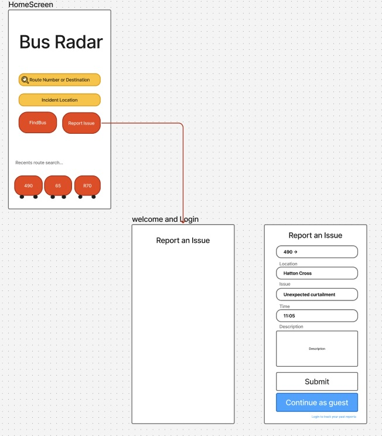

# 🚌 BusRadar App (Frontend)

A mobile-first app to help London commuters avoid buses that curtail (terminate early).

---

---

## 🌟 Core Features (Planned)

- 🔍 Search a bus route or number
- 🗺️ View current buses on map
- ⚠️ See curtailment **risk level** (🔴 / 🟠 / 🟢)
- 📝 Report an issue (e.g. stuck / turned back / skipped stop)
- 📍 Auto-locate user's stop (optional)

---

## ⚙️ Tech Stack

- React Native
- Expo
- Backend: Node + Express + Supabase (PostgreSQL)
